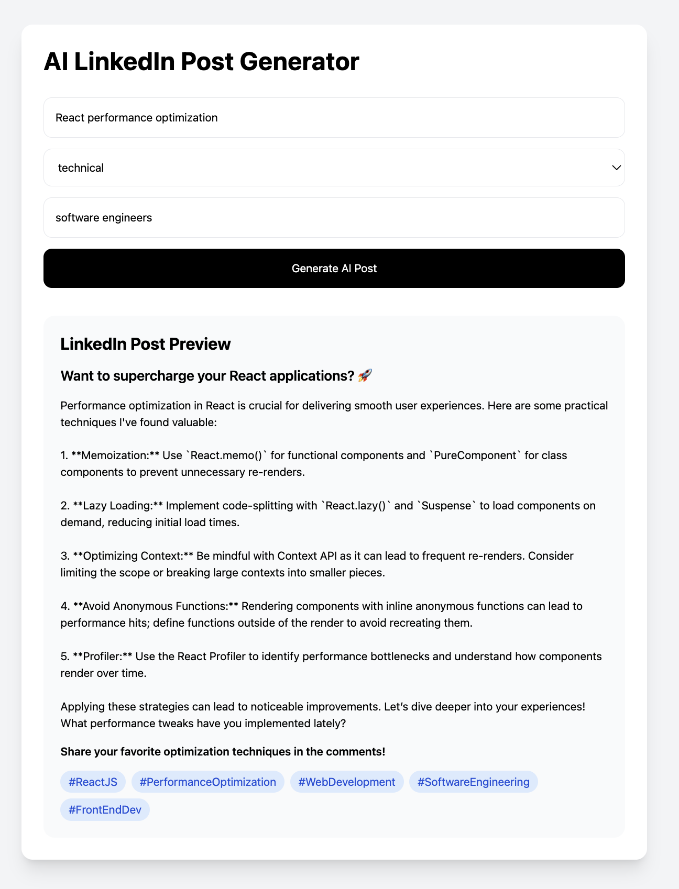

# AI-Powered LinkedIn Content Automation System

A production-minded Node.js API that helps create, approve, schedule, and publish authentic LinkedIn content with AI assistance.

## Features

- **AI post generation** using OpenAI with structured post fields: hook, body, call-to-action, hashtags, full text, and rationale.
- **Human approval workflow** so drafts are reviewed before publishing.
- **Scheduling engine** that checks due posts every minute.
- **Official LinkedIn REST publishing adapter** for text posts via `/rest/posts`.
- **Local JSON persistence** for a lightweight deployable MVP that can be swapped for MySQL/PostgreSQL later.
- **Safe fallback generator** for local demos when `OPENAI_API_KEY` is not configured.

## Tech Stack

- Node.js 24+
- Native HTTP server
- OpenAI Responses API
- LinkedIn REST API
- Built-in interval scheduler
- Local JSON storage

## Quick Start

```bash
cp .env.example .env
npm run dev
```

The API starts at `http://localhost:3000`.

## Environment Variables

| Variable | Purpose |
| --- | --- |
| `OPENAI_API_KEY` | OpenAI API key used for AI content generation. |
| `OPENAI_MODEL` | Model used for generation. Defaults to `gpt-4o-mini`. |
| `LINKEDIN_ACCESS_TOKEN` | OAuth access token with LinkedIn posting access. |
| `LINKEDIN_AUTHOR_URN` | Author URN, for example `urn:li:person:...` or an organization URN. |
| `LINKEDIN_VERSION` | LinkedIn API version header. Defaults to `202601`. |
| `DATA_FILE` | JSON storage path. Defaults to `.data/posts.json`. |

## API Endpoints

### Health Check

```http
GET /health
```

### Generate an AI Draft

```http
POST /api/posts/generate
Content-Type: application/json

{
  "topic": "What backend engineers should know about payment webhook reliability",
  "audience": "SaaS engineering leaders",
  "tone": "practical and authoritative",
  "goal": "start conversations with hiring managers",
  "profile": {
    "name": "Mohd Talha Khan",
    "role": "Software Engineer",
    "pillars": ["backend systems", "payments", "multi-tenant SaaS", "AI integrations"]
  }
}
```

### Save a Draft

```http
POST /api/posts
Content-Type: application/json

{
  "topic": "Payment webhook reliability",
  "draft": {
    "hook": "...",
    "body": "...",
    "callToAction": "...",
    "hashtags": ["#SoftwareEngineering", "#SaaS", "#Payments"],
    "fullText": "...",
    "rationale": "..."
  },
  "scheduledAt": "2026-05-13T10:30:00.000Z"
}
```

### Approve or Schedule a Post

```http
PATCH /api/posts/:id/status
Content-Type: application/json

{
  "status": "approved",
  "scheduledAt": "2026-05-13T10:30:00.000Z"
}
```

### Publish Immediately

```http
POST /api/posts/:id/publish
```

### Run Scheduler Once

```http
POST /api/scheduler/run-once
```

## Safety Notes

This system is designed for compliant content publishing, not spam or artificial engagement. It does not automate likes, comments, scraping, engagement pods, unsolicited messages, or browser-based LinkedIn activity.

## Development

## UI Preview



```bash
npm run lint
npm test
npm run build
```
